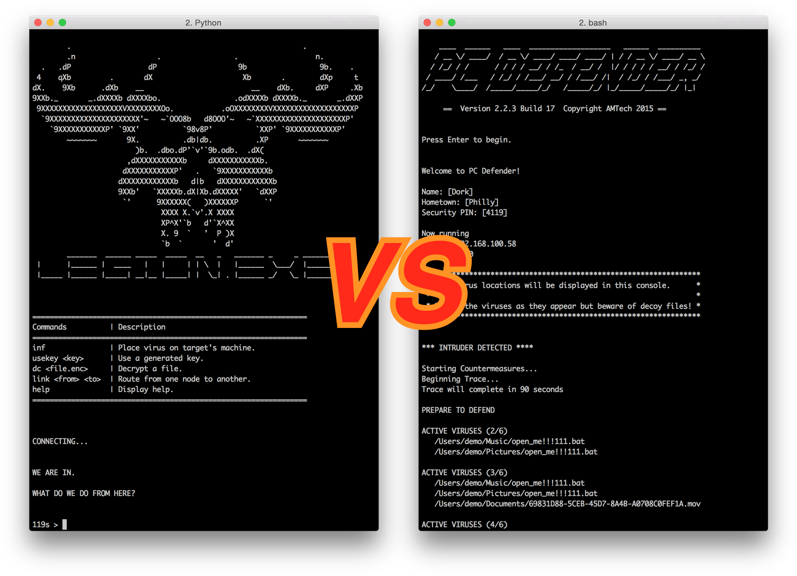

# GGJ2015 - Legion Defender

                               _______  ______ _____  _____  __   _
                        |      |______ |  ____   |   |     | | \  |
                        |_____ |______ |_____| __|__ |_____| |  \_|

                       ____  ___________________   ______  __________ 
                      / __ \/ ____/ ____/ ____/ | / / __ \/ ____/ __ \
                     / / / / __/ / /_  / __/ /  |/ / / / / __/ / /_/ /
                    / /_/ / /___/ __/ / /___/ /|  / /_/ / /___/ _, _/ 
                   /_____/_____/_/   /_____/_/ |_/_____/_____/_/ |_|  
    
    
   
## Overview

Legion Defender is a two player game where one player acts as a hacker, and another a victim who must defend against the hacker's attack.




#### Use of Theme

The hacker is trying to steal information and install viruses on the defender, and must choose what to attack. Therefore he is choosing where to "go" in the defender's computer. The prompt of the hacker's interface is also **`WHERE DO WE GO FROM HERE?`**


#### Modifiers - *Batch Job*

This game is implemented as a single python script. Currently the defender is designed to run on Mac OS X. The hacker works on OS X or Windows, but has additional features on Windows.


### WARNING

This game creates real (but empty and harmless) "virus" "files on your computer. Run with care!


## How to Play

First, download the game script [`legion-defender.py`](https://raw.githubusercontent.com/amrox/GGJ2015/master/final/legion-defender.py).

Or can you use `curl`:
    
```$ curl -O 'https://raw.githubusercontent.com/amrox/GGJ2015/master/final/legion-defender.py'```
    
### Multiplayer Head to Head


 1. Start the defender (aka server/host) and **note the IP Address and Port**:
 
    ```$ python legion-defender.py defend```
    
        Now running
            IP:   192.168.100.58
            PORT: 2000
            
 
 1. Start the hacker (aka client)
 
    ```$ python legion-defender.py hack [ip] 2000```


### Single Player

Both the attacker and defender can be played in single player mode that simulates the other player.


 - **Defender:**
 
    Add `single` to the end of the command to start it.

    ```$ python legion-defender.py defend single```

 - **Hacker:**

    Simply omit the host and port

    ```$ python legion-defender.py hack```
    
    
## Misc

Copyright 2015 Andrew Mroczkowski and Matthew Findlater. All rights reserved.

